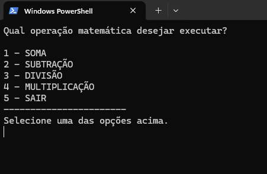
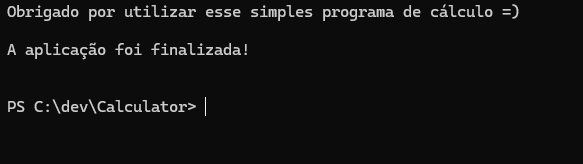

# 🧮 Calculadora em C#  

> Calculadora simples que recebe 2 valores do usuário e realiza operações básicas (+, -, *, /).  

<div align="center">  
  <!-- Badge de licença (opcional) -->
    
  <!-- Badge da versão do .NET -->
    
</div>  

---

## 🛠️ Tecnologias  
- **C#**  
- **.NET 9**  
- **Visual Studio Code**  

---

## 🚀 Como Executar  
1. Clone o repositório:  
   ```bash
   git clone https://github.com/henriqm22/Calculator

   Execute o comando: dotnet run


## 📸 Screenshot Menu


## 📸 Tela Final

